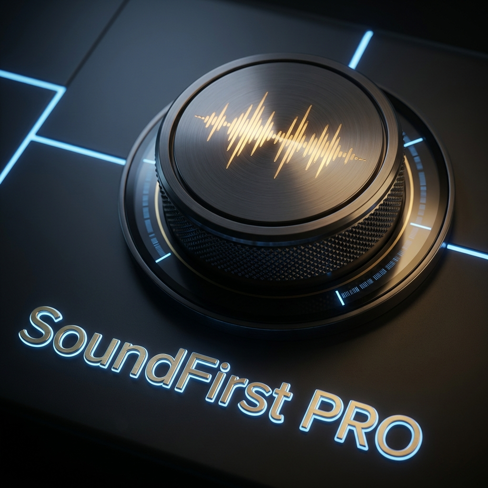

# SoundFirst PRO
### Contextual Musical Interaction System for Komplete Kontrol + REAPER

**“When you remove the visual distraction, all that remains is the truth of the sound.”**

---

## 🚀 What Is It?

SoundFirst PRO is a **`.dll` driver** that transforms your Komplete Kontrol A-Series or M-Series into a deep, contextual control system inside REAPER.

It is not a traditional MIDI map nor a generic script.  
It is a system that understands:

- Which track is selected  
- Which plugin is active  
- Which work mode you are using  

And it automatically adapts **knobs and buttons** to the context of your task, optimizing the **audio** flow.

---

## 🎯 Core Concept

The hardware has no fixed function.  
It adapts to your intent with **4 smart modes**:

| Mode | Function |
|------|---------|
| Mixer | Volume, pan, solo/mute, transport, navigation |
| Plugin | Plugin control with dynamic pages |
| Audio | Clip editing (Trim, Nudge, Fade, Gain, Zoom) |
| MIDI | Note editing (Pitch, length, velocity, grid, transposition) |

Knobs and buttons change their behavior according to the context.

---

## 🧠 Philosophy: Mixing with Muscle Memory

SoundFirst PRO introduces **a physical standard across plugins**:

- **K1 → Main Driver** (Threshold, Input, Peak Reduction, Boost)  
- **K2 → Output Level** (Makeup, Output, Ceiling)  
- Shift + Knob → Secondary parameters  
- Touch Knob → Auto-Solo of the parameter/band  

Your hand learns the mix.  
Not your eyes.

---

## ⚡ Smart Auto-Solo

- Touch a parameter → it is soloed.  
- Release → the full mix returns.  
- No menus, no clicks, no breaking the audio flow.

---

## 🔊 Auditory Feedback

Includes actions that:

- Announce peak level  
- Report gain reduction on mapped compressors  

Professional audio metering **without relying on sight**.

---

## 🔧 Extended Resolution (10-Bits)

We leverage the full hardware resolution (0–1023 steps) for:

- Greater precision  
- Smoother control  
- A more natural experience

---

## 🛠 Installation

Installation is straightforward:

1. Download the latest version from **Releases**.  
2. Copy the `.dll` file into the folder: `UserPlugins` of REAPER.
3. Restart REAPER.  
4. Enjoy.

No need to select models, configure profiles, or do manual mapping.  
The system initializes automatically.

### ⚠️ If the keyboard does not respond

Make sure the **Komplete Kontrol DAW port is free** in REAPER's MIDI preferences.

---

## 🧩 Extensibility: SoundFirst PRO Mapper

Includes a graphical tool to:

- Create mappings for any VST/AU/CLAP plugin  
- Auto-dump parameters from REAPER  
- Multiple pages and smart actions  
- Auto-recognition by plugin name  

Any user can create, share, and improve mappings.

---

## 💻 Supported Hardware

- Komplete Kontrol A49  
- Komplete Kontrol A61  
- Komplete Kontrol M32  

Framework designed to expand to more devices in the future.

---

## 📖 The Story

Born in a corner of my living room, without funding.  
Just a Komplete Kontrol A61 and a conviction:  
**producing music should feel like playing an instrument**.

Existing integrations offered neither contextual control nor an audio-centric flow.  
So I reinterpreted the hardware and built SoundFirst PRO.

Every function exists because it solves a real flow problem.  
It remains independent and humble, but its design standard is professional.

---

## 📜 License

GNU GPL v3 – Open source and independent project.

---

## 🤝 Community

Join the chat and share your mappings: [Telegram](https://t.me/SoundFirstPRO)  
Support development: [Buy Me a Coffee](https://buymeacoffee.com/soundfirstpro)  

---

© 2026 José Pérez  
[Leer en Español](README_ES.md)
